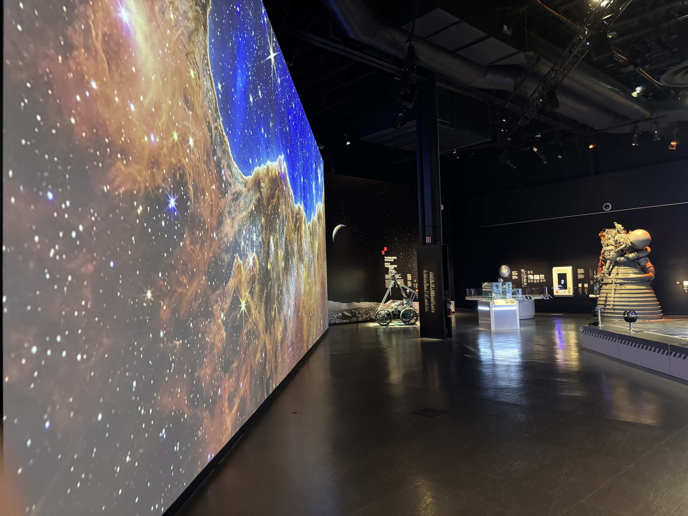
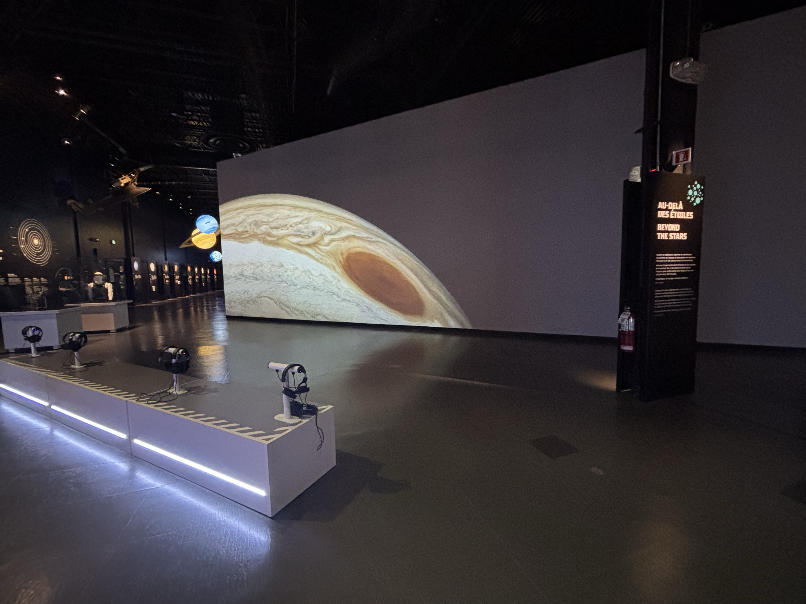
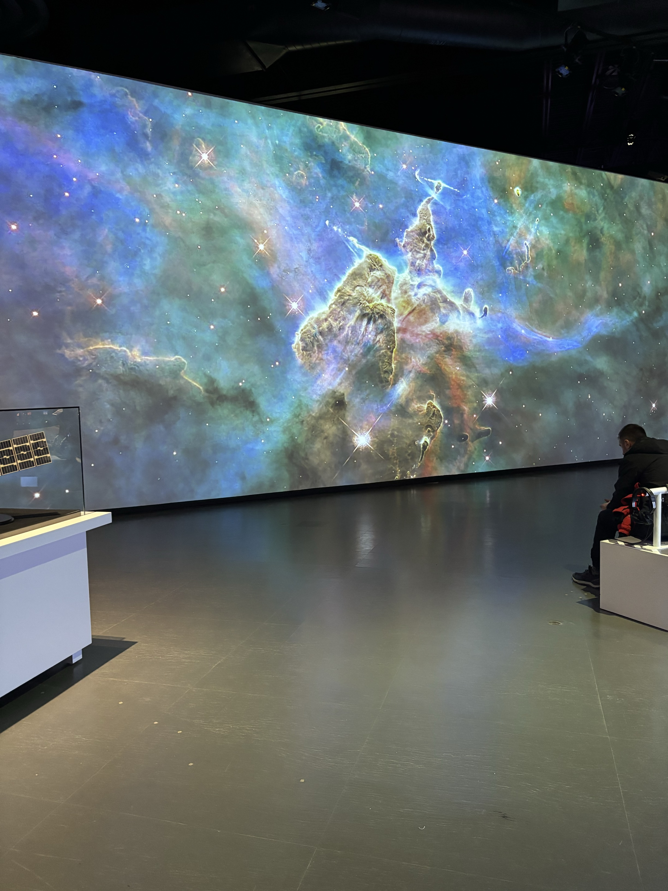

# Destination: L'espace

#### Au cœur du Cosmodôme de Laval, l’exposition Destination : l’espace, réalisée en décembre 2024, propose aux visiteurs de plonger dans l’histoire et le futur de l’exploration spatiale. Grâce à un parcours immersif et interactif, on découvre les grandes étapes des missions spatiales, des premières conquêtes lunaires jusqu’aux technologies modernes comme le télescope spatial James Webb. Des maquettes de fusées, des stations d’expérimentation, des modules interactifs et des projections visuelles rendent l’expérience à la fois éducative et captivante.

Le Cosmodôme à Laval est un musée scientifique spécialisé dans l’exploration de l’espace. Il rend les sciences accessibles au grand public à travers des installations variées et bien pensées. C’est dans ce cadre que j’ai effectué ma visite individuelle le 21 février 2025, où j’ai eu l’occasion de découvrir une œuvre immersive très intéressante et intuitive.

  
  
  

Photos prises par moi

## Au-delà des étoiles
#### "Au-delà des étoiles" est une projection immersive créée par l'entreprise 4 ELEMENTS, réalisée par Alexandre Desjardins en décembre 2024. Cette œuvre permanente et immersive offre une expérience multimédia de 6 minutes qui combine des images de synthèse, des effets visuels, une narration scientifique et une musique originale. Elle retrace les grandes étapes de l'exploration spatiale, tout en mettant en lumière les instruments développés par l'humanité pour observer l'univers. Le spectateur est invité à voyager au cœur des galaxies à travers un récit captivant et accessible, alliant esthétique cosmique et narration pédagogique. Ce dispositif crée ainsi une expérience à la fois contemplative et éducative, plongeant l'audience dans un univers fascinant et enrichissant.

L’œuvre dure environ six minutes et propose une narration bilingue en français et en anglais, rendant le contenu accessible à un large public. Elle aborde plusieurs thématiques liées à l’astronomie, notamment l’exploration spatiale, l’histoire des grandes découvertes scientifiques et les instruments développés pour observer l’univers. Le tout s’inscrit dans une approche hybride entre le documentaire immersif et l’art visuel éducatif, où la beauté des images renforce la dimension pédagogique de l’expérience.

  
  
  

 Photos prises par moi.
 
## shéma

  

Shéma fait par moi.

## matériel utilisé
L’installation utilise un grand écran blanc sur lequel est projeté le film à l’aide d’un projecteur suspendu au plafond. Devant l’écran, un banc équipé de plusieurs casques audio permet aux visiteurs de suivre l’expérience de manière immersive et individuelle. Des lumières LED intégrées à l’arrière du banc ajoutent une ambiance visuelle moderne à l’espace. Même si l’œuvre est placée au cœur du musée, le port du casque crée une forme d’intimité, en isolant le spectateur du bruit ambiant pour le plonger pleinement dans l’univers présenté.

  
  
  

Photo prise par moi.

## Expérience personnelle
Je m’assois sur un banc et mets un casque de son sur la tête. Dès les premières secondes, je suis emporté·e par les images grandioses et la richesse sonore du film.
L’écran est immense et l’environnement sonore crée une véritable bulle immersive. L’histoire, très pédagogique, est facile à suivre tout en stimulant l’imagination.
On se sent tout petit face à l’univers, mais aussi curieux et fasciné.

<a href="https://www.youtube.com/watch?v=E9eEFIE-xdw" target="_blank">vidéo de l'installation</a>
vidéo filmé par moi

## Appréciation / critique
L'œuvre présente plusieurs points forts qui la rendent particulièrement marquante. Tout d'abord, les images sont absolument magnifiques et remarquablement bien réalisées, offrant une représentation saisissante de l'univers. L'ambiance sonore et visuelle est également très immersive, plongeant le spectateur dans un environnement captivant qui stimule à la fois les sens et l'imagination. Enfin, la narration est parfaitement adaptée, rendant l’expérience à la fois accessible et éducative, ce qui permet à chacun, quel que soit son niveau de connaissance en astronomie, de s'approprier le récit et d'enrichir sa compréhension de l'exploration spatiale.

Cependant, il existe quelques détails que j’aimerais souligner. L’installation étant située au milieu du musée, elle perd parfois en immersion, car des visiteurs peuvent passer devant l’écran, ce qui perturbe l’expérience. Pour améliorer cela, je ferais en sorte que l’œuvre soit installée dans un espace plus isolé, offrant une expérience plus intime et centrée, loin des distractions extérieures.

  

## Références à d'autres œuvres ou dispositifs
Cette expérience m’a immédiatement rappelé l’œuvre Ravel Ravel Interval d’Anri Sala, vue au Musée des beaux-arts de Montréal. Dans les deux cas, l’atmosphère sonore et visuelle est d’une telle intensité qu’elle parvient à aspirer le spectateur dans un autre monde. Ce qui est frappant, c'est la manière dont l’ambiance créée par l’image et le son devient presque palpable, à tel point qu’on se sent absorbé par l’environnement. L’installation d'Anri Sala repose sur une synchronisation parfaite entre les visuels et la musique, un effet hypnotique qui capte notre attention de façon immersive. De manière similaire, Au-delà des étoiles utilise cette même alchimie entre la projection visuelle et l’ambiance sonore pour immerger totalement le spectateur, le transportant au cœur de l’univers. Dans les deux œuvres, l’expérience sensorielle va au-delà de la simple observation : elle éveille notre imagination et nous fait vivre une véritable exploration intérieure.

## Conclusion
Au-delà des étoiles a été une expérience intéressante, qui m’a permis de mieux comprendre comment l’image, le son et la narration peuvent travailler ensemble pour créer une ambiance immersive. Même si ce n’est pas l’œuvre qui m’a le plus marqué cette session, elle reste un bon exemple d’installation éducative et accessible. Elle m’a tout de même fait réfléchir à la manière dont on peut capter l’attention du public en rendant un contenu complexe plus engageant.

  
  
  

