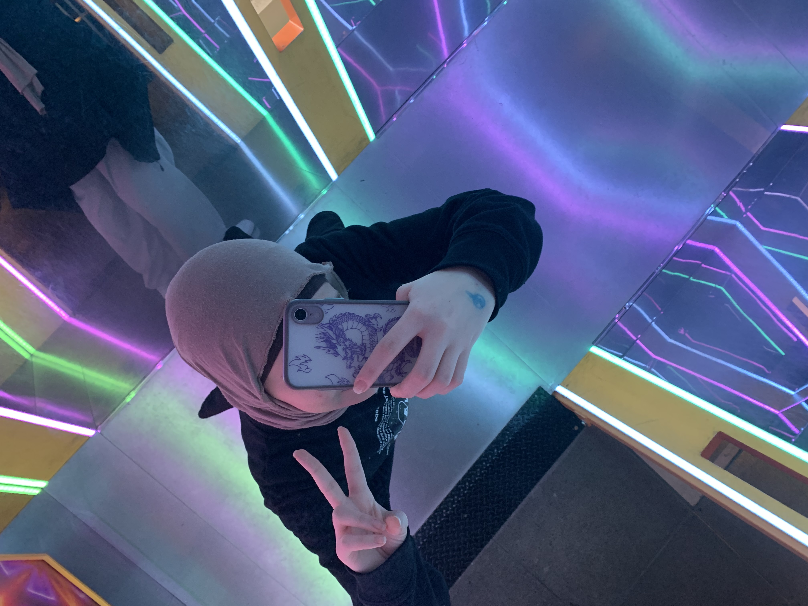

## Ça porte à réfléchir

#### L'exposition permanente "La science en grand" du Centre des sciences de Montréal propose une expérience immersive et interactive qui invite les visiteurs à découvrir la science sous un angle nouveau. À travers des installations innovantes, chaque espace permet d'explorer des concepts scientifiques complexes de manière ludique et accessible. Les technologies de pointe créent des environnements immersifs, où les frontières entre la science et la réalité se dissolvent, ouvrant de nouveaux horizons. 

#### L'exposition couvre divers domaines, tels que la physique, l'astronomie et les biotechnologies, et met en lumière l'importance de la recherche scientifique. "La science en grand" est une expérience fascinante, accessible à tous, qui permet d'approfondir notre compréhension du monde.

  

Moi à l'entrée du Centre des sciences de montréal au 2 R. de la Commune O, Montréal, QC H2Y 4B2 le 31 janvier 2025

## Reflets infinis

### Quand on se regarde dans un miroir, on voit simplement notre reflet, fidèle à la réalité. Mais que se passe-t-il quand plusieurs miroirs se font face ? La lumière rebondit encore et encore, créant une illusion d’infini où l’espace semble s’étirer bien au-delà de ses limites réelles. En ajoutant des lumières et des images animées, on perturbe encore plus nos repères : ce qui est réel et ce qui est reflet se mélangent, et notre perception de l’espace se retrouve complètement transformée.

Les miroirs reflètent la lumière et notre image, mais lorsqu’ils s’assemblent en une structure géométrique infinie, ils créent une illusion envoûtante.
Ici, un écran placé stratégiquement au fond diffuse une image kaléidoscopique vibrante, qui est ensuite reflétée par les multiples surfaces miroitées. Chaque reflet se démultiplie, formant un tunnel lumineux aux motifs hypnotisants, où les jeux de symétrie et de profondeur brouillent nos repères et nous immergent dans un univers surréaliste.

  
  
  

moi dans le tunnel lumineux le 7 novembre 2024

## La fabrication

**Ça porte à réfléchir** (2019) est une installation immersive conçue et réalisée par **TKNL – créateur d’expériences**. Grâce à un jeu de miroirs et de lumières, elle multiplie les reflets à l’infini, transformant notre perception de l’espace et de la réalité.

  

#### Le module comporte une installation assez simple et pas trop complex. À l’arrière, deux écrans forme un pentagone qui diffusent des images kaléidoscopiques en mouvement, hypnotisant le regard avec une beauté immersive. Tout autour, des miroirs placés sur chaque paroi multiplient les reflets à l’infini, donnant l’impression de plonger dans un autre univers. Des lumières LED soulignent les contours et amplifient la sensation de profondeur. L’ensemble repose sur une structure en métal, assurant à la fois solidité et légèreté, pour une immersion totale dans ce jeu de reflets et de lumière.

  

Croquis créer par moi même.
 
 
Le musée doit fournir une **alimentation électrique** adéquate pour alimenter les écrans et les lumières LED. Il est également essentiel de prévoir un **espace suffisamment grand** pour accueillir la structure tout en permettant une circulation fluide des visiteurs. De plus, une **signalétique** claire doit être mise en place pour expliquer l’œuvre et indiquer les consignes d’interaction aux visiteurs.

## L'utilisation

  

## Conclusion
Pour moi, j'ai particulièrement aimé les jeux de lumière avec l'effet infini. Ce qui m'a frappé, c'est son côté esthétique, avec les lumières qui semblent se prolonger à l'infini. C'est vraiment impressionnant et captivant. Le tunnel, en particulier, m'a attiré immédiatement, car il crée une atmosphère immersive et visuellement stimulante. C'est ce mélange entre science et art qui m'a beaucoup inspiré, et j'ai trouvé que cet aspect visuel ajoutait une dimension magique à l'exposition. J'ai aussi aimée la table du Banquet, j'ai trouvée l'immersion magnifique.

  
  
  

