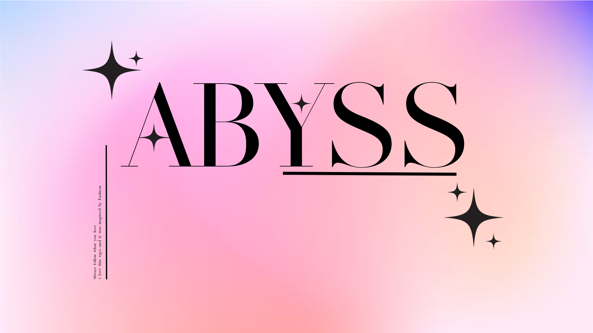
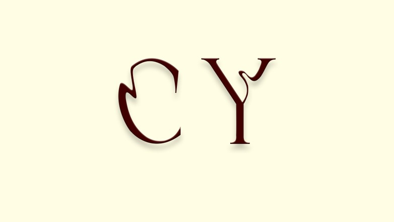
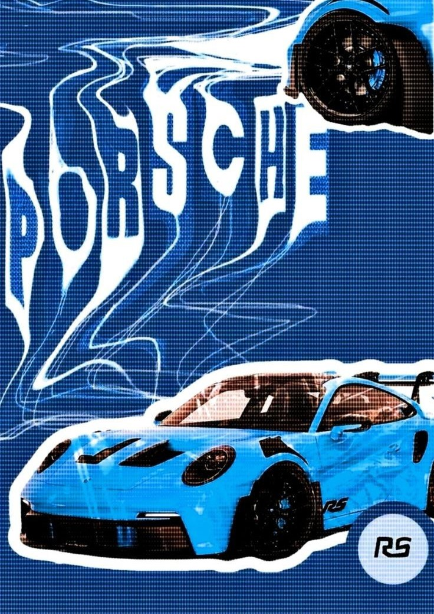
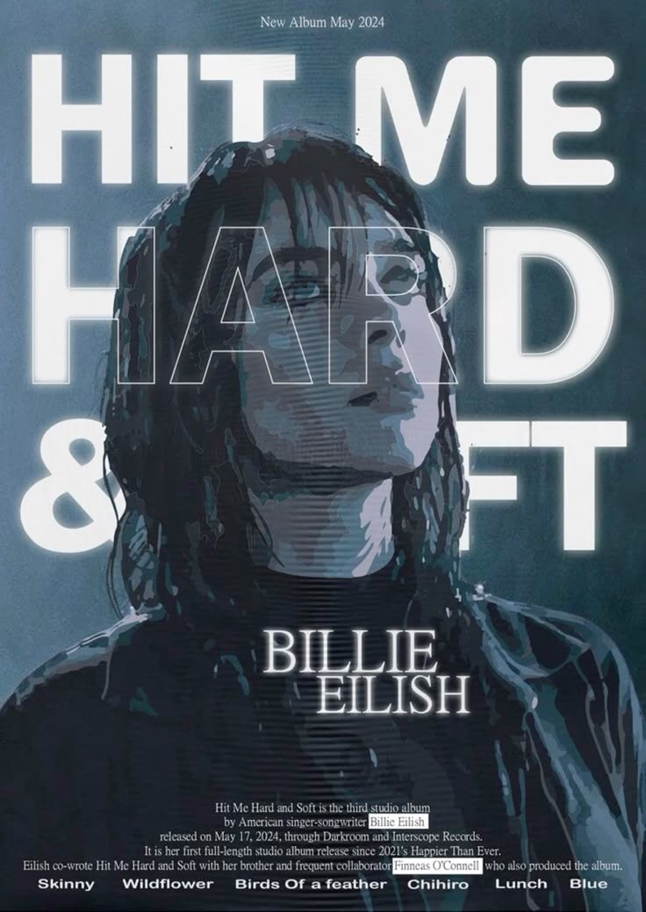
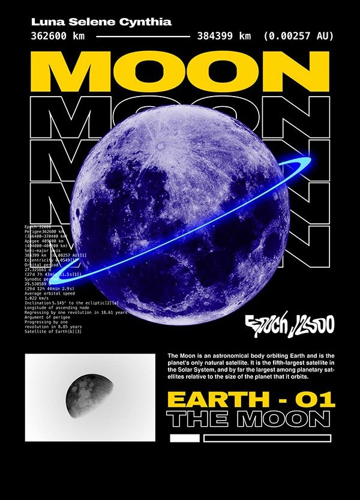

# Cyrine Ghiat

Portrait de design graphic sur photoshop fait par moi pour un projet de première session TIM.

## Intérêts dans le multimedia

J'ai intérêt dans les arts divers, plus particulièrement le design graphique, mais pas que.
J'aime bien peindre des toiles et faire des peinture, crée des petits dessins de tout genre avec de la peinture. Le montage vidéo est un autre coup de coeur personnelle, j'ai fait mon propre film de voyage, etc. 

## Mes inspirations

Je m'inspire de différents design qui se trouve sur Pinterest et j'aimerai arriver à ce niveau dans le futur

  
  
  

  J'aime rire et j'aime faire rire les autres, je trouve que c'est les meilleures moments dans une vie. 

