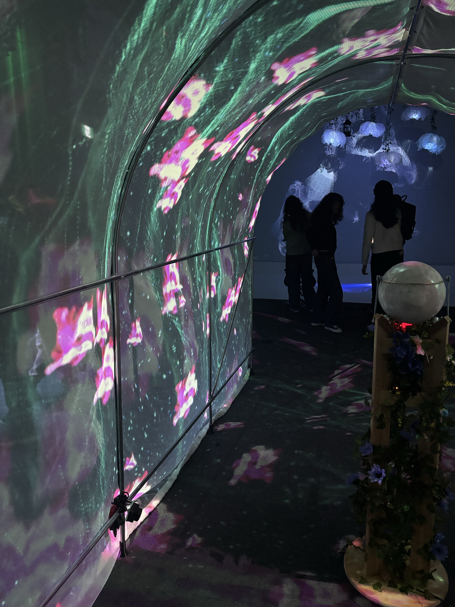
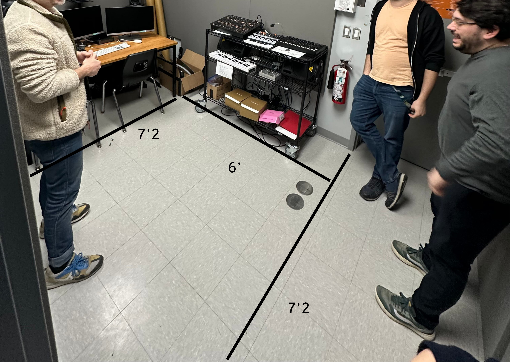
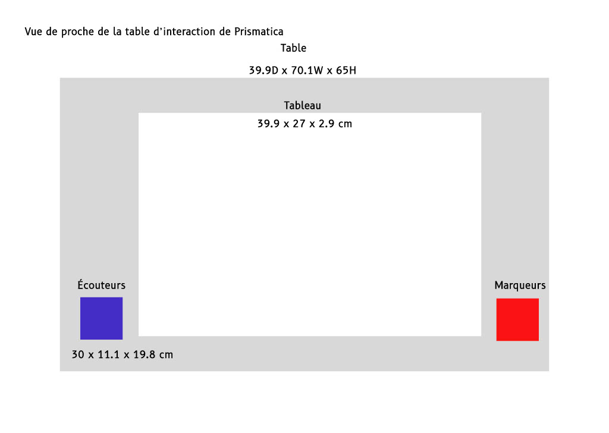

# L'exposition Resonance!
### Résonance est une exposition créée par les finissants du programme Intégration Multimédia au Cégep, où l’art et la technologie se rencontrent pour offrir des expériences interactives uniques. À travers une série d’installations multimédias, les visiteurs ont l’opportunité de plonger dans des univers où les couleurs, les sons et l’interactivité se mélangent pour créer des moments inoubliables. Chaque projet, réalisé par les étudiants, montre leur créativité et leur savoir-faire technique, tout en offrant une réflexion sur notre relation avec la technologie et notre environnement. L’exposition est une célébration de l’innovation et de l’exploration, un espace où l’art et la technologie fusionnent pour toucher les sens et l’imaginaire. Les installations sont temporaire et finale.

## Internature
Internature est un projet réalisé par Kenza El Harrif, Isaac Fafard, Delphine Grenier, Khaly Tia Sing et Sitmonternna Yi. 

Ce projet prend la forme d’un tunnel immersif intégrant du mapping vidéo interactif sur ses parois. L’utilisateur est invité à interagir avec une boule, déclenchant un spectacle de lumière dynamique. À travers cette expérience visuelle et sensorielle, Internature pousse à une réflexion sur l’impact de l’humain sur la nature.

  
  
  

photo prise par moi.

### shémas
 

  

  

  

  

  

shémas réalisées par l'équipe d'internature.

### ressenti
Internature propose une immersion dans un univers où la nature et la technologie se rencontrent. J’ai trouvé intéressant la manière dont ils ont intégré des éléments naturels avec des interactions numériques. Avant de l’expérimenter, je m’attendais à une ambiance apaisante et immersive, et après coup, j’ai trouvé que l’installation réussissait bien à transmettre cette atmosphère harmonieuse

## Etheria
Etheria est une installation interactive conçue par Maik Hamel, Victor Gileau, Pierre-Luc Proulx, Joshua Gonzalez-Barrera et Michael Un Dupré.  

Ce projet propose un jeu interactif se déroulant dans un univers fantastique, avec un style graphique inspiré du pixel art. Les joueurs utilisent des figurines ou pions pour défendre un cristal contre des vagues d’ennemis. L’œuvre met en avant la stratégie et la coopération, des éléments clés pour réussir dans cet univers immersif.

  
   
  

photo prise par moi.

### shémas
 

  

shémas réalisées par l'équipe d'Etheria.

### ressenti
Etheria m’a plongé dans un univers fantastique où chaque mouvement comptait. Le jeu de stratégie, tout en étant simple à comprendre, demandait une véritable réflexion. J’ai adoré l’aspect coopératif avec les autres joueurs. Le pixel art apportait une touche nostalgique, et le fait de défendre le cristal contre des vagues d’ennemis m’a vraiment tenu en haleine. Une expérience de jeu amusante et stimulante.

## Prismatica
Prismatica est un projet réalisé par Vincent Deliste, IKrame Rata et Jérémy Duverseau.   

Prismatica explore la chromesthésie, un phénomène où les couleurs et les sons sont associés. Chaque tracé génère des visuels et une correspondance sonore en temps réel, créant ainsi une expérience immersive où les couleurs et les sons interagissent harmonieusement. L'utilisateur est plongé dans un univers sensoriel captivant, où l’art visuel et sonore se fusionnent pour créer une expérience inédite.

  
   
  

photo prise par moi.

### shémas
 

  

  

  

  

  

shémas réalisées par l'équipe de Prismatica.

### ressenti
Prismatica m’a émerveillé dès que j’ai vu comment les couleurs et les sons se synchronisaient en temps réel. Le fait que chaque tracé génère une réaction visuelle et sonore était très intéressant. J'ai adoré l'harmonie entre les deux sensations.

## Fuga
Un projet réalisé par Djeral Abdel Ali, Gucluer Yavuz-Selim, Labelle Matis, Dezemma Daniel Sébastien et Khadka Tristan.   

Fuga propose une expérience immersive où les participants peuvent modeler des arbres à leur image en ajustant des curseurs contrôlant diverses caractéristiques de l’arbre. Chaque modification a un impact direct sur l’ambiance sonore, créant ainsi une atmosphère unique et harmonieuse. Cette interaction entre visuel et son permet aux utilisateurs de créer leur propre environnement naturel.

  
   
  

photo prise par moi.

### shémas
 

  

  

  

shémas réalisées par l'équipe d'Etheria.

### ressenti
Etheria m’a plongé dans un univers fantastique où chaque mouvement comptait. Le jeu de stratégie, tout en étant simple à comprendre, demandait une véritable réflexion. J’ai adoré l’aspect coopératif avec les autres joueurs. Le pixel art apportait une touche nostalgique, et le fait de défendre le cristal contre des vagues d’ennemis m’a vraiment tenu en haleine. Une expérience de jeu amusante et stimulante.
