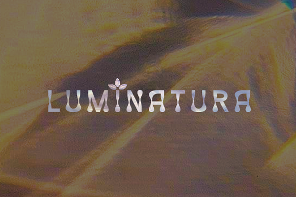
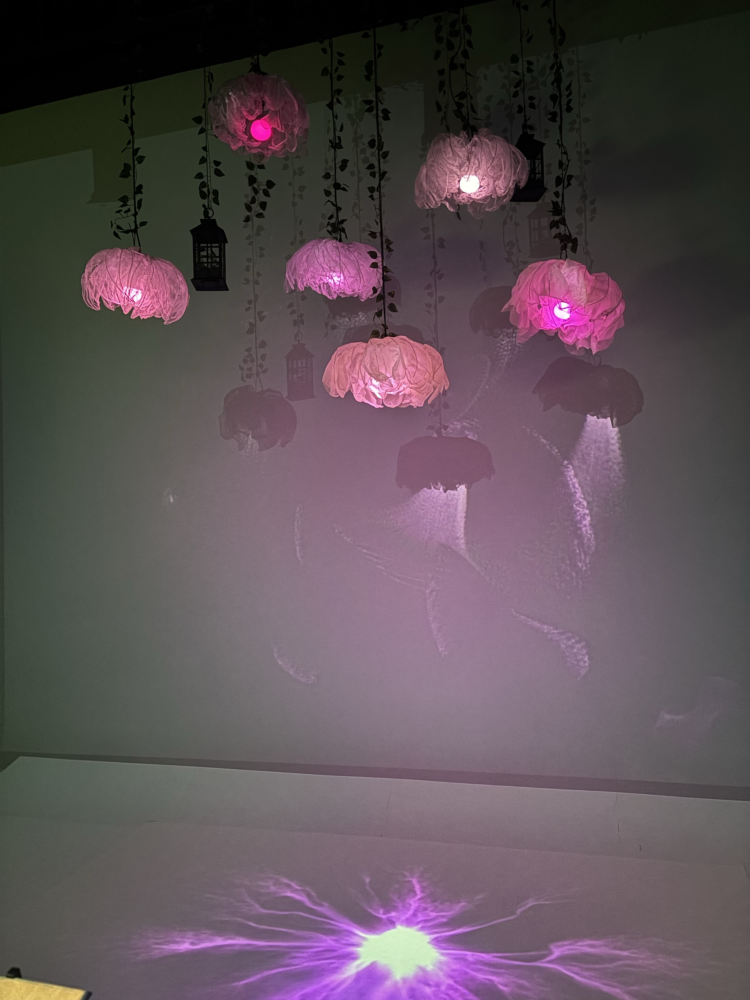
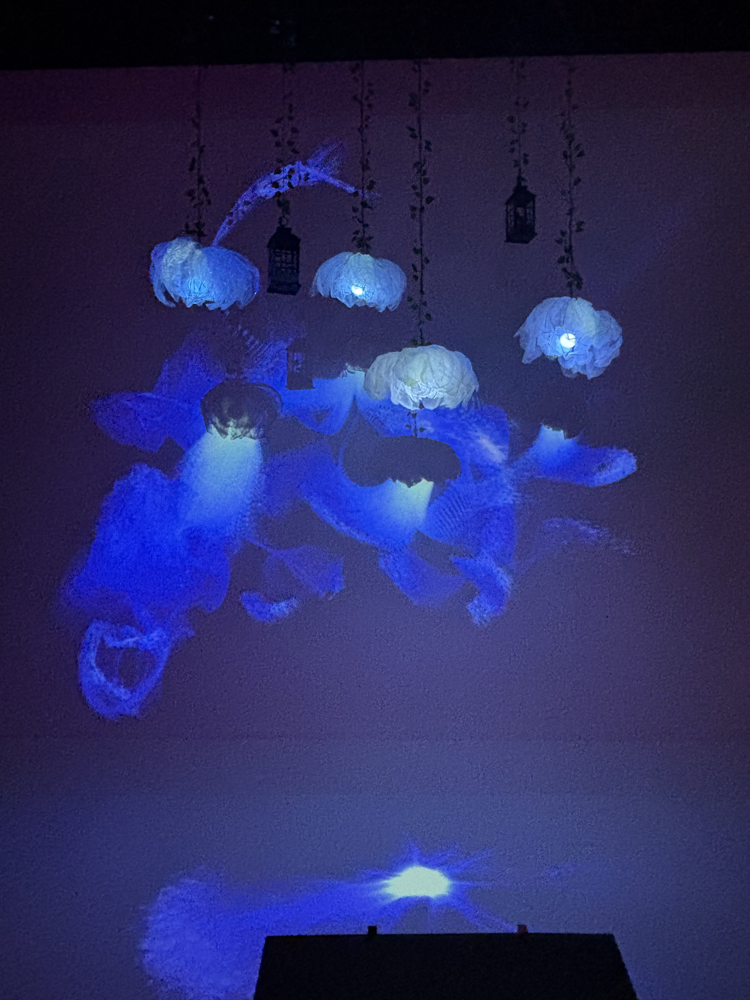
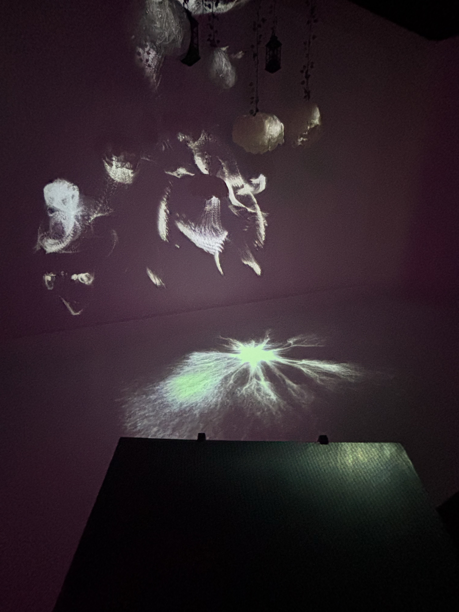
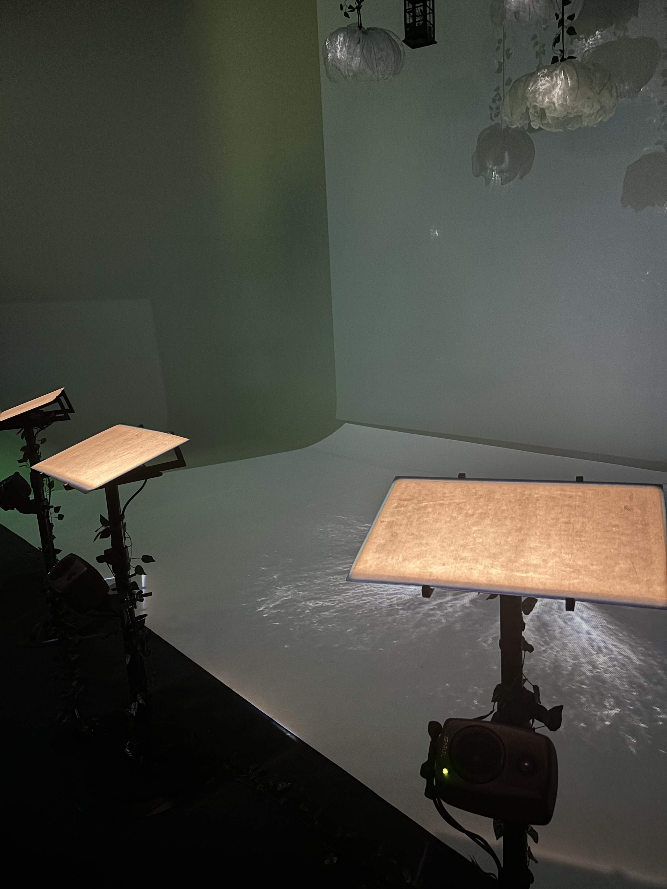
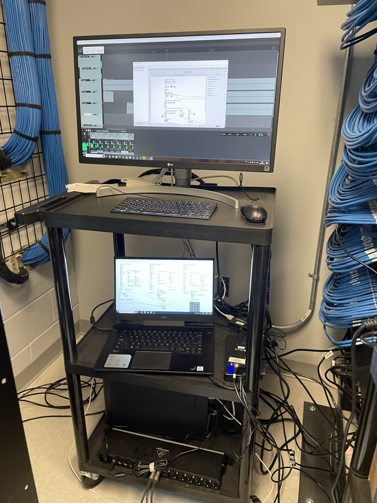
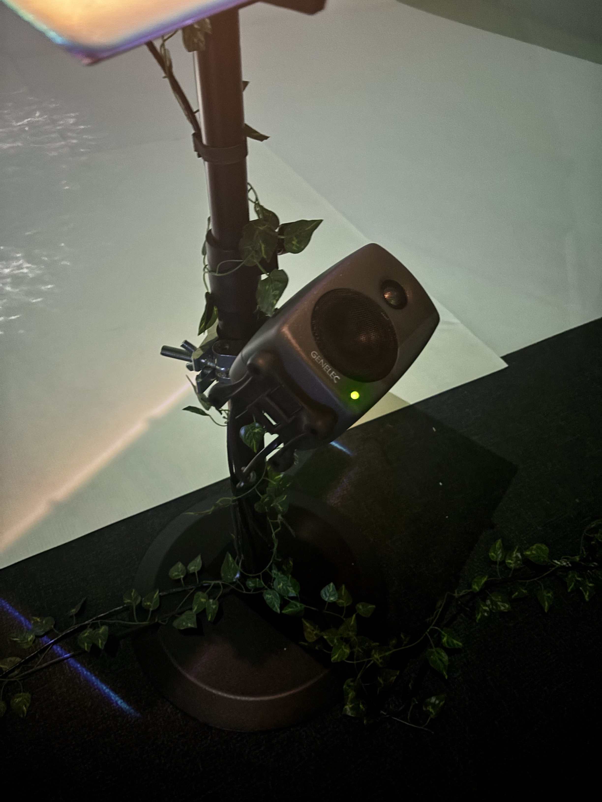
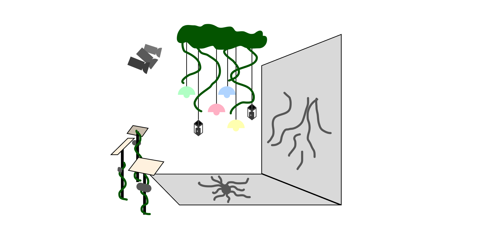

# Luminatura – Une expérience immersive et interactive

  

#### Luminatura est une installation immersive conçue par Camilia Bouatmani, Audrey Dandurand, Ihab Mouhajer, Prethiah Rajaratnam et Justine Rousseau présentée au Cégep Montmorency. Elle est une installation temporaire qui offre aux visiteurs une expérience sensorielle unique. À la croisée de l’art et de la technologie, cette œuvre interactive explore comment la lumière peut influencer l’engagement du spectateur. En permettant à chacun de participer, elle crée une relation directe entre l'œuvre et ceux qui l'explorent, rendant l'expérience à la fois personnelle et immersive.

  
  
  

Les différentes couleurs de l'instalation

## Description
#### Luminatura est une fusion entre art et technologie qui transporte les visiteurs dans un univers sensoriel unique. Des fleurs lumineuses, des vignes suspendues et des lanternes délicates créent un décor enchanteur. L’interaction avec des plaques métalliques, semblables à des pupitres de chef d’orchestre, déclenche des jeux de lumière colorés et des sons inspirés de la nature, projetant des motifs lumineux sur les murs.

L'installation combine capteurs capacitifs, Arduino et logiciels interactifs pour offrir une expérience immersive. En touchant des plaques métalliques, les visiteurs activent des jeux de lumière et des sons naturels, projetés sur les murs grâce à des LEDs et projecteurs. Le tout est orchestré par un ordinateur, tandis que des fleurs lumineuses, lanternes et vignes suspendues ajoutent une touche poétique à l’installation.

Un mélange de logiciels et de matériel interactif est instaurés, notamment Puredata, PlugData, TouchDesign, QLC+, Reaper et Arduino, permettant une synchronisation fluide entre les interactions et l’environnement lumineux et sonore.

  
  
  

matériels utilisés

## Shémas

  

