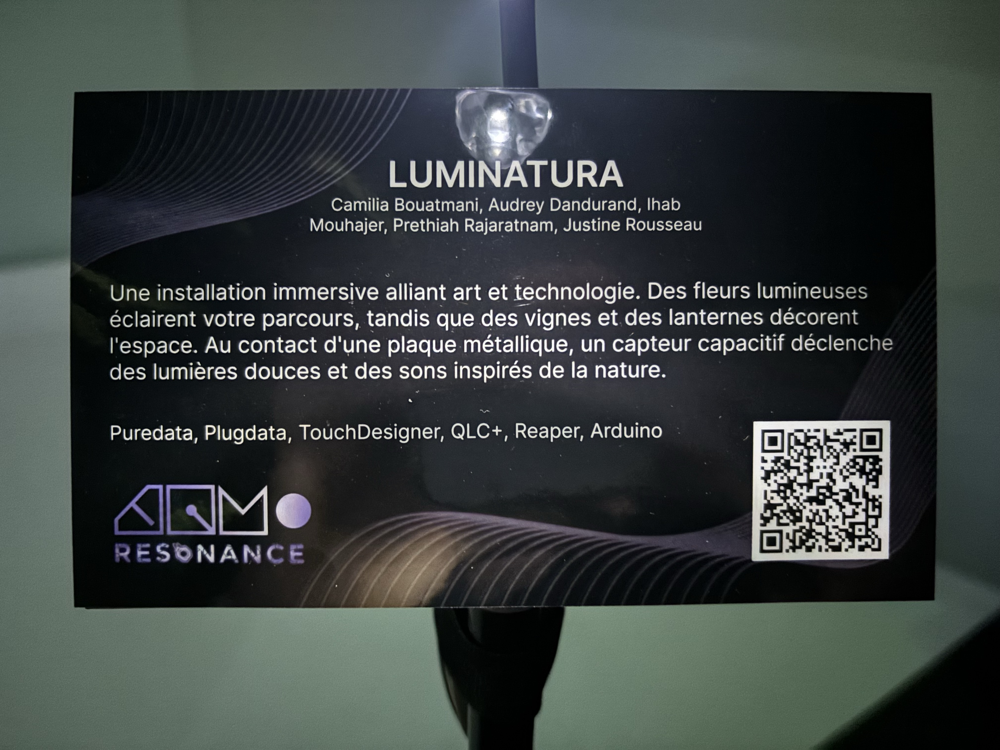
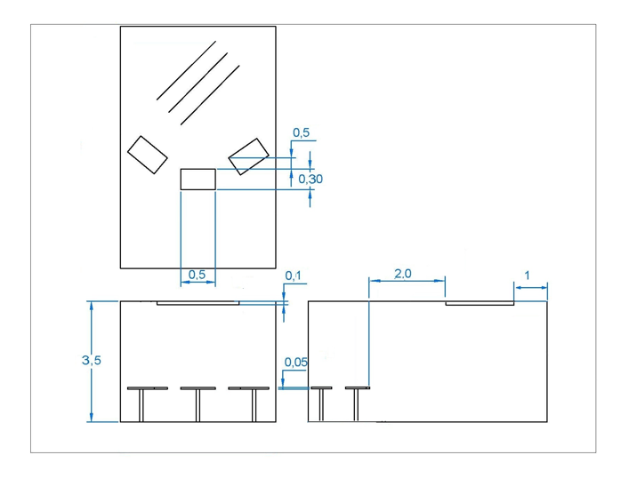
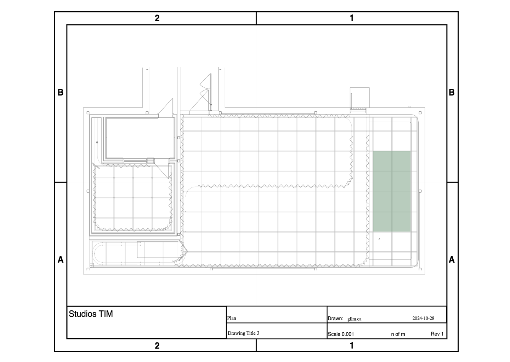

# Luminatura – Une expérience immersive et interactive

  

#### Luminatura est une installation immersive conçue par Camilia Bouatmani, Audrey Dandurand, Ihab Mouhajer, Prethiah Rajaratnam et Justine Rousseau présentée au Cégep Montmorency. Elle est une installation temporaire qui offre aux visiteurs une expérience sensorielle unique. À la croisée de l’art et de la technologie, cette œuvre interactive explore comment la lumière peut influencer l’engagement du spectateur. En permettant à chacun de participer, elle crée une relation directe entre l'œuvre et ceux qui l'explorent, rendant l'expérience à la fois personnelle et immersive.

  

description de l'oeuvre, photo prise par moi.

  
  
  

Les différentes couleurs de l'instalation, photos prises par moi.

## Description
#### Luminatura est une fusion entre art et technologie qui transporte les visiteurs dans un univers sensoriel unique. Des fleurs lumineuses, des vignes suspendues et des lanternes délicates créent un décor enchanteur. L’interaction avec des plaques métalliques, semblables à des pupitres de chef d’orchestre, déclenche des jeux de lumière colorés et des sons inspirés de la nature, projetant des motifs lumineux sur les murs.

L'installation combine capteurs capacitifs, Arduino et logiciels interactifs pour offrir une expérience immersive. En touchant des plaques métalliques, les visiteurs activent des jeux de lumière et des sons naturels, projetés sur les murs grâce à des LEDs et projecteurs. Le tout est orchestré par un ordinateur, tandis que des fleurs lumineuses, lanternes et vignes suspendues ajoutent une touche poétique à l’installation.

Un mélange de logiciels et de matériel interactif est instaurés, notamment Puredata, PlugData, TouchDesign, QLC+, Reaper et Arduino, permettant une synchronisation fluide entre les interactions et l’environnement lumineux et sonore.

  
  
  

matériels utilisés, photo prise par moi.

##### Le projet nécessite plusieurs équipements spécialisés pour assurer le traitement et la diffusion des médias riches. Parmi ces équipements, on trouve des stations de travail multimédia et des ordinateurs (PC et portables) avec GPU dédié, ainsi que des microcontrôleurs comme l’Arduino et l’ESP32 (M5Stack Atom) pour des tâches de calcul en temps réel. Pour la diffusion vidéo, deux projecteurs haute résolution sont utilisés, accompagnés de haut-parleurs actifs et de cartes de son multi-canaux pour l’audio. Enfin, des systèmes d’éclairage DMX et des LEDs adressables permettent de créer des environnements lumineux dynamiques et immersifs.

## Shémas

  

shéma conçue par moi.

  

  

## Expérience utilisateur
#### Avant l’expérience, le spectateur est intrigué et curieux devant cette installation mystérieuse. Après l’interaction, il repart émerveillé, ayant vécu une expérience immersive où lumière et son répondent à ses gestes.

[vidéo utilisateur YouTube Short](https://youtube.com/shorts/T1O86cZ9BfU?si=-Znbrktvf9UuwsY2)

## Conclusion
J’ai choisi Luminatura comme mon projet préféré, car je l’ai trouvé émerveillant et magnifique. Son aspect interactif est vraiment impressionnant et apporte une dimension ludique et immersive. L’interaction avec la lumière et les couleurs rend l’expérience unique et engageante, ce qui en fait, selon moi, l’un des projets les plus captivants de l’exposition.

  

